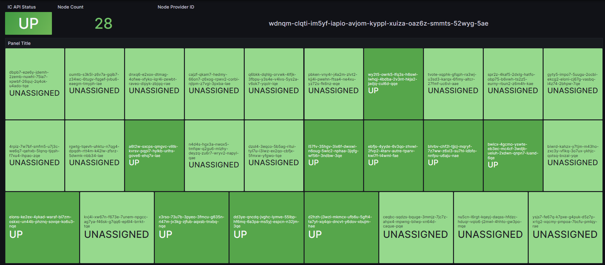

# IC Node Status Prometheus Exporter

Prometheus exporter for Internet Computer nodes status based on the IC API.

API compatiblity: `v3`


# Quick Start

Replace `<your-id>` with your node provider ID which can be found here:

https://dashboard.internetcomputer.org/providers

```bash
# Clone git repository
git clone github.com/virtualhive/ic-node-status-prometheus-exporter
cd ic-node-status-prometheus-exporter

# Install dependencies
pip3 install -r requirements.txt

# Set your node provider ID
export NODE_PROVIDER_ID=<your-id>

# Start the exporter (default port: 8000)
python3 ./ic-node-status-prometheus-exporter.py
```

# Systemd Setup

## 1. Preparation

```bash
# Add unprivileged user
sudo adduser icnodes --gecos ""

# Switch to icnodes user
sudo su - icnodes

# Clone repository
git clone github.com/virtualhive/ic-node-status-prometheus-exporter
cd ic-node-status-prometheus-exporter

# Install dependencies
pip3 install -r requirements.txt
```

## 2. Setup .env file

Create a `.env` file in `/home/icnodes/ic-node-status-prometheus-exporter/` with the following content (replace `<your-id>` with your node provider ID):

```
NODE_PROVIDER_ID=<your-id>
```

## 3. Create and run systemd service

```bash
# Switch back to a sudoers user

# Copy the service file
sudo cp /home/icnodes/ic-node-status-prometheus-exporter/icnodes.service /etc/system/system/icnodes.service

# Register the service
sudo systemctl daemon-reload

# Run the service
sudo systemctl start icnodes

# Check if everything is OK
sudo systemctl status icnodes
```


# Integration

## Prometheus

### Scraping

```yaml
  - job_name: 'ic_nodes'
    scrape_interval: 60s
    static_configs:
      - targets: ['<ip>:8000']
```

### Alerting

Example alerting rules.

For the `IcNodesMissing` alert you need to change the number of nodes (`ic_node_count < 28`) to your individual expected node count.

```yaml
- name: ICNodes
  rules:
  - alert: IcNodeStatusFault
    expr: ic_node_status > 2
    for: 5m
    annotations:
      title: 'IC node is faulty!'
      description: 'IC node {{ $labels.node_id }} changed to status {{ $value }}. Dashboard link to node: https://dashboard.internetcomputer.org/node/{{ $labels.node_id }}'
    labels:
      severity: 'critical'
  - alert: IcNodeStatusParsingError
    expr: ic_node_status == 0
    for: 5m
    annotations:
      title: 'IC node status is unknown!'
      description: 'IC node {{ $labels.node_id }} status could not be parsed by the exporter. Dashboard link to node: https://dashboard.internetcomputer.org/node/{{ $labels.node_id }}'
    labels:
      severity: 'warning'
  - alert: IcApiDown
    expr: ic_node_api_up == 0
    for: 5m
    annotations:
      title: 'IC API is down!'
      description: 'IC API is down for more than 5 minutes! Current IC node metrics are not reliable.'
    labels:
      severity: 'warning'
  - alert: IcNodesMissing
    expr: ic_node_count < 28
    for: 5m
    annotations:
      title: 'IC node(s) missing!'
      description: 'IC API did not return the expected number of nodes. Currently returning {{ $value }} nodes.'
    labels:
      severity: 'critical'
```

## Grafana Dashboard

Before importing the dashboard, change the number of expected nodes in line 154 in `dashboard.json`.

You can click on the individual nodes or the node provider ID within the dashboard to open up the corresponding dashboard.internetcomputer.org site.

In Grafana go to `Dashboards` --> `New` --> `Import` and paste the json content from the file `dashboard.json` into `Import via panel json`.




# Settings

Settings can be set either by creating a `.env` file in the current working dir or by setting environment variables. Settings in the `.env` file will be overwritten if environment variables are set.

**It is required to set the NODE_PROVIDER_ID.**


|Envvar Name|Default Value|Example|
|-----------|-------------|-------|
|NODE_PROVIDER_ID|None|lq5ra-f4ibl-t7wpy-hennc-m4eb7-tnfxe-eorgd-onpsl-wervo-7chjj-6qe|
|EXPORTER_PORT|8000|8888|


# Metrics

```
ic_node_api_up - Status of the IC API
ic_node_count - Number of nodes found for the given node provider ID
ic_node_status - Numerical encoded status of the IC node
```


# Status Codes

Each `ic_node_status` metric's value is set to a number between **0** and **5** which represent one of the following status codes:

* 0: The IC API response for this node's status could not be interpreted
* 1: UP
* 2: UNASSIGNED
* 3: DEGRADED
* 4: DOWN
* 5: UNRECOGNIZED


# Architecture

The exporter scrapes the IC API every 60s and on successful scrape exports the results in the Prometheus format.

If the IC API is not responding as expected, the metric `ic_node_api_up` becomes `0`.

Based on the response of the IC API the `ic_node_count` will be set to the number of nodes found. The `ic_node_status` metric will then be populated for each node with a status code and the following labels:

* node_id
* node_operator_id
* node_provider_id
* node_provider_name
* owner
* region
* subnet_id
* ip_address
* dc_id
* dc_name


# Metrics Example

```txt
# HELP ic_node_api_up Status of the IC API
# TYPE ic_node_api_up gauge
ic_node_api_up 1.0
# HELP ic_node_count Number of nodes found for the given node provider ID
# TYPE ic_node_count gauge
ic_node_count{node_provider_id="lq5ra-f4ibl-t7wpy-hennc-m4eb7-tnfxe-eorgd-onpsl-wervo-7chjj-6qe"} 28.0
# HELP ic_node_status Numerical encoded status of the IC node
# TYPE ic_node_status gauge
ic_node_status{dc_id="bo1",dc_name="Boston",ip_address="2600:c0d:3002:4:6801:dfff:fee7:5ae8",node_id="4jtgm-ywxcc-xh3o3-x2omx-tgmdm-gobca-agb3a-alvw4-dhmyn-khis6-xae",node_operator_id="ut325-qbq5v-fli2f-e2a5h-qapdd-fsuyv-xej2j-ogvux-i3fc2-5nj3a-2ae",node_provider_id="lq5ra-f4ibl-t7wpy-hennc-m4eb7-tnfxe-eorgd-onpsl-wervo-7chjj-6qe",node_provider_name="DFINITY USA Research LLC",owner="INAP",region="North America,US,Massachusetts",subnet_id="None"} 2.0
ic_node_status{dc_id="bo1",dc_name="Boston",ip_address="2600:c0d:3002:4:6801:59ff:fe2a:f53b",node_id="4wpdz-2h276-lbrzr-nro2a-c7cjl-ivkxz-psqjf-grrrc-7hqem-f66qd-zqe",node_operator_id="ut325-qbq5v-fli2f-e2a5h-qapdd-fsuyv-xej2j-ogvux-i3fc2-5nj3a-2ae",node_provider_id="lq5ra-f4ibl-t7wpy-hennc-m4eb7-tnfxe-eorgd-onpsl-wervo-7chjj-6qe",node_provider_name="DFINITY USA Research LLC",owner="INAP",region="North America,US,Massachusetts",subnet_id="None"} 2.0
ic_node_status{dc_id="bo1",dc_name="Boston",ip_address="2600:c0d:3002:4:6801:f2ff:feb4:de96",node_id="5djxc-oflqt-exy2d-ka2dg-nndl7-pzw2n-sgquq-75cal-v23ht-uxzkt-tqe",node_operator_id="ut325-qbq5v-fli2f-e2a5h-qapdd-fsuyv-xej2j-ogvux-i3fc2-5nj3a-2ae",node_provider_id="lq5ra-f4ibl-t7wpy-hennc-m4eb7-tnfxe-eorgd-onpsl-wervo-7chjj-6qe",node_provider_name="DFINITY USA Research LLC",owner="INAP",region="North America,US,Massachusetts",subnet_id="None"} 2.0
ic_node_status{dc_id="bo1",dc_name="Boston",ip_address="2600:c0d:3002:4:6801:18ff:fe27:db36",node_id="664pj-z6lri-encbc-qpm5p-gjv7i-qvf3s-uyst7-xpfal-xtkas-dbpgp-kqe",node_operator_id="ut325-qbq5v-fli2f-e2a5h-qapdd-fsuyv-xej2j-ogvux-i3fc2-5nj3a-2ae",node_provider_id="lq5ra-f4ibl-t7wpy-hennc-m4eb7-tnfxe-eorgd-onpsl-wervo-7chjj-6qe",node_provider_name="DFINITY USA Research LLC",owner="INAP",region="North America,US,Massachusetts",subnet_id="None"} 2.0
ic_node_status{dc_id="bo1",dc_name="Boston",ip_address="2600:c0d:3002:4:6801:82ff:fec9:49d5",node_id="67i4t-repqq-g4e5c-prcmq-nh3zp-xwdwz-e3pwf-w6sfw-gqr4i-znc4c-yae",node_operator_id="ut325-qbq5v-fli2f-e2a5h-qapdd-fsuyv-xej2j-ogvux-i3fc2-5nj3a-2ae",node_provider_id="lq5ra-f4ibl-t7wpy-hennc-m4eb7-tnfxe-eorgd-onpsl-wervo-7chjj-6qe",node_provider_name="DFINITY USA Research LLC",owner="INAP",region="North America,US,Massachusetts",subnet_id="None"} 2.0
ic_node_status{dc_id="bo1",dc_name="Boston",ip_address="2600:c0d:3002:4:6801:19ff:fe8c:de47",node_id="af7ti-auyik-jfsne-tljmz-6purg-2msmy-jw34z-b4ie3-abk5f-h23xt-zae",node_operator_id="ut325-qbq5v-fli2f-e2a5h-qapdd-fsuyv-xej2j-ogvux-i3fc2-5nj3a-2ae",node_provider_id="lq5ra-f4ibl-t7wpy-hennc-m4eb7-tnfxe-eorgd-onpsl-wervo-7chjj-6qe",node_provider_name="DFINITY USA Research LLC",owner="INAP",region="North America,US,Massachusetts",subnet_id="w4rem-dv5e3-widiz-wbpea-kbttk-mnzfm-tzrc7-svcj3-kbxyb-zamch-hqe"} 1.0
ic_node_status{dc_id="bo1",dc_name="Boston",ip_address="2600:c0d:3002:4:6801:3eff:fe99:d2",node_id="bd5ij-46qqy-2kvsc-dlrxx-ep6kx-thotd-3jyxy-xekbw-kkdta-jwi4t-dae",node_operator_id="ut325-qbq5v-fli2f-e2a5h-qapdd-fsuyv-xej2j-ogvux-i3fc2-5nj3a-2ae",node_provider_id="lq5ra-f4ibl-t7wpy-hennc-m4eb7-tnfxe-eorgd-onpsl-wervo-7chjj-6qe",node_provider_name="DFINITY USA Research LLC",owner="INAP",region="North America,US,Massachusetts",subnet_id="None"} 2.0
ic_node_status{dc_id="bo1",dc_name="Boston",ip_address="2600:c0d:3002:4:6801:46ff:fe78:ef9e",node_id="br34g-3vg7a-a5enq-jysmz-gm7nt-zz7np-6qiz6-nopmh-mfrwc-vspa3-tae",node_operator_id="ut325-qbq5v-fli2f-e2a5h-qapdd-fsuyv-xej2j-ogvux-i3fc2-5nj3a-2ae",node_provider_id="lq5ra-f4ibl-t7wpy-hennc-m4eb7-tnfxe-eorgd-onpsl-wervo-7chjj-6qe",node_provider_name="DFINITY USA Research LLC",owner="INAP",region="North America,US,Massachusetts",subnet_id="None"} 2.0
ic_node_status{dc_id="bo1",dc_name="Boston",ip_address="2600:c0d:3002:4:6801:95ff:fe9b:81c3",node_id="d3e4o-lzo7o-edq5a-aiebe-kudf7-j2dqh-fowbh-du4xw-luzlh-wxhd3-gqe",node_operator_id="ut325-qbq5v-fli2f-e2a5h-qapdd-fsuyv-xej2j-ogvux-i3fc2-5nj3a-2ae",node_provider_id="lq5ra-f4ibl-t7wpy-hennc-m4eb7-tnfxe-eorgd-onpsl-wervo-7chjj-6qe",node_provider_name="DFINITY USA Research LLC",owner="INAP",region="North America,US,Massachusetts",subnet_id="None"} 2.0
ic_node_status{dc_id="bo1",dc_name="Boston",ip_address="2600:c0d:3002:4:6801:ccff:feca:b74a",node_id="dhuj2-ftdaf-zp53t-76w3c-xe4q4-x5cvo-uraiv-672js-h3bl4-hrhqz-2qe",node_operator_id="ut325-qbq5v-fli2f-e2a5h-qapdd-fsuyv-xej2j-ogvux-i3fc2-5nj3a-2ae",node_provider_id="lq5ra-f4ibl-t7wpy-hennc-m4eb7-tnfxe-eorgd-onpsl-wervo-7chjj-6qe",node_provider_name="DFINITY USA Research LLC",owner="INAP",region="North America,US,Massachusetts",subnet_id="None"} 2.0
ic_node_status{dc_id="bo1",dc_name="Boston",ip_address="2600:c0d:3002:4:6801:94ff:fec9:6b",node_id="fd5e4-a2xzl-lxu7m-kjvn6-2arnt-jghro-rdrgx-zvvkd-j2hza-pbwl4-5qe",node_operator_id="ut325-qbq5v-fli2f-e2a5h-qapdd-fsuyv-xej2j-ogvux-i3fc2-5nj3a-2ae",node_provider_id="lq5ra-f4ibl-t7wpy-hennc-m4eb7-tnfxe-eorgd-onpsl-wervo-7chjj-6qe",node_provider_name="DFINITY USA Research LLC",owner="INAP",region="North America,US,Massachusetts",subnet_id="None"} 2.0
ic_node_status{dc_id="bo1",dc_name="Boston",ip_address="2600:c0d:3002:4:6801:e8ff:fe63:e52b",node_id="g3jye-pe4af-ugyxv-z7ag5-3m5ms-s3ibo-utma3-xqa5d-7742b-xb6tr-kae",node_operator_id="ut325-qbq5v-fli2f-e2a5h-qapdd-fsuyv-xej2j-ogvux-i3fc2-5nj3a-2ae",node_provider_id="lq5ra-f4ibl-t7wpy-hennc-m4eb7-tnfxe-eorgd-onpsl-wervo-7chjj-6qe",node_provider_name="DFINITY USA Research LLC",owner="INAP",region="North America,US,Massachusetts",subnet_id="None"} 2.0
ic_node_status{dc_id="bo1",dc_name="Boston",ip_address="2600:c0d:3002:4:6801:e7ff:fe29:db0e",node_id="id2le-fhh6d-bqc5m-uza7x-tih4p-ghysr-otoju-dkuxz-y32qk-ygynt-7ae",node_operator_id="ut325-qbq5v-fli2f-e2a5h-qapdd-fsuyv-xej2j-ogvux-i3fc2-5nj3a-2ae",node_provider_id="lq5ra-f4ibl-t7wpy-hennc-m4eb7-tnfxe-eorgd-onpsl-wervo-7chjj-6qe",node_provider_name="DFINITY USA Research LLC",owner="INAP",region="North America,US,Massachusetts",subnet_id="None"} 2.0
ic_node_status{dc_id="bo1",dc_name="Boston",ip_address="2600:c0d:3002:4:6801:66ff:fef6:eb05",node_id="iev4c-24zfk-fk3t5-i24fh-e6yhu-xx26q-rzsdq-aukdo-xd2ex-thlpl-cqe",node_operator_id="ut325-qbq5v-fli2f-e2a5h-qapdd-fsuyv-xej2j-ogvux-i3fc2-5nj3a-2ae",node_provider_id="lq5ra-f4ibl-t7wpy-hennc-m4eb7-tnfxe-eorgd-onpsl-wervo-7chjj-6qe",node_provider_name="DFINITY USA Research LLC",owner="INAP",region="North America,US,Massachusetts",subnet_id="None"} 2.0
ic_node_status{dc_id="bo1",dc_name="Boston",ip_address="2600:c0d:3002:4:6801:e0ff:fe3e:cd28",node_id="ik7kx-ejjyb-duuem-davt4-whf4q-t33ai-izjat-3yiko-kjjgw-3iago-qae",node_operator_id="ut325-qbq5v-fli2f-e2a5h-qapdd-fsuyv-xej2j-ogvux-i3fc2-5nj3a-2ae",node_provider_id="lq5ra-f4ibl-t7wpy-hennc-m4eb7-tnfxe-eorgd-onpsl-wervo-7chjj-6qe",node_provider_name="DFINITY USA Research LLC",owner="INAP",region="North America,US,Massachusetts",subnet_id="None"} 2.0
ic_node_status{dc_id="bo1",dc_name="Boston",ip_address="2600:c0d:3002:4:6801:d3ff:fe3a:c18e",node_id="nwjwl-gfnnf-zpo2o-ciacp-hvdgm-53rbb-5uysh-lleob-47rbt-rsehe-uae",node_operator_id="ut325-qbq5v-fli2f-e2a5h-qapdd-fsuyv-xej2j-ogvux-i3fc2-5nj3a-2ae",node_provider_id="lq5ra-f4ibl-t7wpy-hennc-m4eb7-tnfxe-eorgd-onpsl-wervo-7chjj-6qe",node_provider_name="DFINITY USA Research LLC",owner="INAP",region="North America,US,Massachusetts",subnet_id="None"} 2.0
ic_node_status{dc_id="bo1",dc_name="Boston",ip_address="2600:c0d:3002:4:6801:35ff:feb2:86e9",node_id="oa4zo-rk7lp-iwpe3-raybn-xique-c7lbx-qu5qn-qpzit-zzr73-asq36-zae",node_operator_id="ut325-qbq5v-fli2f-e2a5h-qapdd-fsuyv-xej2j-ogvux-i3fc2-5nj3a-2ae",node_provider_id="lq5ra-f4ibl-t7wpy-hennc-m4eb7-tnfxe-eorgd-onpsl-wervo-7chjj-6qe",node_provider_name="DFINITY USA Research LLC",owner="INAP",region="North America,US,Massachusetts",subnet_id="None"} 2.0
ic_node_status{dc_id="bo1",dc_name="Boston",ip_address="2600:c0d:3002:4:6801:21ff:febb:aa9a",node_id="ojohy-bikhs-4rhct-vawxt-zejuj-as3nh-zg7x4-kd4vj-6snox-jg6vd-pae",node_operator_id="ut325-qbq5v-fli2f-e2a5h-qapdd-fsuyv-xej2j-ogvux-i3fc2-5nj3a-2ae",node_provider_id="lq5ra-f4ibl-t7wpy-hennc-m4eb7-tnfxe-eorgd-onpsl-wervo-7chjj-6qe",node_provider_name="DFINITY USA Research LLC",owner="INAP",region="North America,US,Massachusetts",subnet_id="None"} 2.0
ic_node_status{dc_id="bo1",dc_name="Boston",ip_address="2600:c0d:3002:4:6801:bcff:fee7:4008",node_id="q2ucv-x7dv5-hheao-ocsye-jbg4z-enm75-ss62d-ehqhj-zwwm3-cap5q-tqe",node_operator_id="ut325-qbq5v-fli2f-e2a5h-qapdd-fsuyv-xej2j-ogvux-i3fc2-5nj3a-2ae",node_provider_id="lq5ra-f4ibl-t7wpy-hennc-m4eb7-tnfxe-eorgd-onpsl-wervo-7chjj-6qe",node_provider_name="DFINITY USA Research LLC",owner="INAP",region="North America,US,Massachusetts",subnet_id="None"} 2.0
ic_node_status{dc_id="bo1",dc_name="Boston",ip_address="2600:c0d:3002:4:6801:9eff:fe4d:57c5",node_id="rfik5-ueo7z-7onkv-gnw5z-abjr5-64i4i-prly4-edkr4-3myl3-zkovh-cae",node_operator_id="ut325-qbq5v-fli2f-e2a5h-qapdd-fsuyv-xej2j-ogvux-i3fc2-5nj3a-2ae",node_provider_id="lq5ra-f4ibl-t7wpy-hennc-m4eb7-tnfxe-eorgd-onpsl-wervo-7chjj-6qe",node_provider_name="DFINITY USA Research LLC",owner="INAP",region="North America,US,Massachusetts",subnet_id="None"} 2.0
ic_node_status{dc_id="bo1",dc_name="Boston",ip_address="2600:c0d:3002:4:6801:bcff:fea0:dea1",node_id="tk7c2-vuwkh-cllbs-6wqbw-bilx5-g27gf-ytrm2-24llv-fl47r-tma5c-uae",node_operator_id="ut325-qbq5v-fli2f-e2a5h-qapdd-fsuyv-xej2j-ogvux-i3fc2-5nj3a-2ae",node_provider_id="lq5ra-f4ibl-t7wpy-hennc-m4eb7-tnfxe-eorgd-onpsl-wervo-7chjj-6qe",node_provider_name="DFINITY USA Research LLC",owner="INAP",region="North America,US,Massachusetts",subnet_id="None"} 2.0
ic_node_status{dc_id="bo1",dc_name="Boston",ip_address="2600:c0d:3002:4:6801:f8ff:fe30:b32f",node_id="tkjd7-67pky-t52ju-l2nae-poag7-pmlkf-vvsrd-byrl7-tgh3z-ca7f2-rqe",node_operator_id="ut325-qbq5v-fli2f-e2a5h-qapdd-fsuyv-xej2j-ogvux-i3fc2-5nj3a-2ae",node_provider_id="lq5ra-f4ibl-t7wpy-hennc-m4eb7-tnfxe-eorgd-onpsl-wervo-7chjj-6qe",node_provider_name="DFINITY USA Research LLC",owner="INAP",region="North America,US,Massachusetts",subnet_id="None"} 2.0
ic_node_status{dc_id="bo1",dc_name="Boston",ip_address="2600:c0d:3002:4:6801:1ff:fe38:393a",node_id="v2tn3-ioqn4-rkthu-o5urm-qk2zn-kwcyh-q7h5e-vncxr-refgi-wsgk5-6ae",node_operator_id="ut325-qbq5v-fli2f-e2a5h-qapdd-fsuyv-xej2j-ogvux-i3fc2-5nj3a-2ae",node_provider_id="lq5ra-f4ibl-t7wpy-hennc-m4eb7-tnfxe-eorgd-onpsl-wervo-7chjj-6qe",node_provider_name="DFINITY USA Research LLC",owner="INAP",region="North America,US,Massachusetts",subnet_id="None"} 2.0
ic_node_status{dc_id="bo1",dc_name="Boston",ip_address="2600:c0d:3002:4:6801:89ff:fe7c:5cba",node_id="w5v5z-fcppt-a43do-cb2aq-uvl3a-kog7c-ijff2-3scow-pk7uf-6cr6q-jqe",node_operator_id="ut325-qbq5v-fli2f-e2a5h-qapdd-fsuyv-xej2j-ogvux-i3fc2-5nj3a-2ae",node_provider_id="lq5ra-f4ibl-t7wpy-hennc-m4eb7-tnfxe-eorgd-onpsl-wervo-7chjj-6qe",node_provider_name="DFINITY USA Research LLC",owner="INAP",region="North America,US,Massachusetts",subnet_id="None"} 2.0
ic_node_status{dc_id="bo1",dc_name="Boston",ip_address="2600:c0d:3002:4:6801:5bff:fe9c:57c6",node_id="wrlf2-3vbmx-cchct-vvdya-d53vz-tma44-zjv5t-xcbpv-qgaio-2333m-fae",node_operator_id="ut325-qbq5v-fli2f-e2a5h-qapdd-fsuyv-xej2j-ogvux-i3fc2-5nj3a-2ae",node_provider_id="lq5ra-f4ibl-t7wpy-hennc-m4eb7-tnfxe-eorgd-onpsl-wervo-7chjj-6qe",node_provider_name="DFINITY USA Research LLC",owner="INAP",region="North America,US,Massachusetts",subnet_id="None"} 2.0
ic_node_status{dc_id="bo1",dc_name="Boston",ip_address="2600:c0d:3002:4:6801:45ff:fe34:dbe7",node_id="ye7hj-6vkr5-lfzi5-kmlhk-ghdxd-nk4tu-tjjmh-hu5as-mpqs3-a27mc-xqe",node_operator_id="ut325-qbq5v-fli2f-e2a5h-qapdd-fsuyv-xej2j-ogvux-i3fc2-5nj3a-2ae",node_provider_id="lq5ra-f4ibl-t7wpy-hennc-m4eb7-tnfxe-eorgd-onpsl-wervo-7chjj-6qe",node_provider_name="DFINITY USA Research LLC",owner="INAP",region="North America,US,Massachusetts",subnet_id="None"} 2.0
ic_node_status{dc_id="bo1",dc_name="Boston",ip_address="2600:c0d:3002:4:6801:c1ff:fea1:e37b",node_id="yqw3m-oz2zj-iumts-2b36x-2kgcr-iaeph-qsa4l-icno4-rqn7g-dqgcb-rae",node_operator_id="ut325-qbq5v-fli2f-e2a5h-qapdd-fsuyv-xej2j-ogvux-i3fc2-5nj3a-2ae",node_provider_id="lq5ra-f4ibl-t7wpy-hennc-m4eb7-tnfxe-eorgd-onpsl-wervo-7chjj-6qe",node_provider_name="DFINITY USA Research LLC",owner="INAP",region="North America,US,Massachusetts",subnet_id="None"} 2.0
ic_node_status{dc_id="bo1",dc_name="Boston",ip_address="2600:c0d:3002:4:6801:f2ff:feae:35a4",node_id="zwj7g-vr2fu-mei6y-mg6rb-lluav-v3rjp-lwez7-74d62-ltspf-2mxh3-rqe",node_operator_id="ut325-qbq5v-fli2f-e2a5h-qapdd-fsuyv-xej2j-ogvux-i3fc2-5nj3a-2ae",node_provider_id="lq5ra-f4ibl-t7wpy-hennc-m4eb7-tnfxe-eorgd-onpsl-wervo-7chjj-6qe",node_provider_name="DFINITY USA Research LLC",owner="INAP",region="North America,US,Massachusetts",subnet_id="None"} 2.0
```

